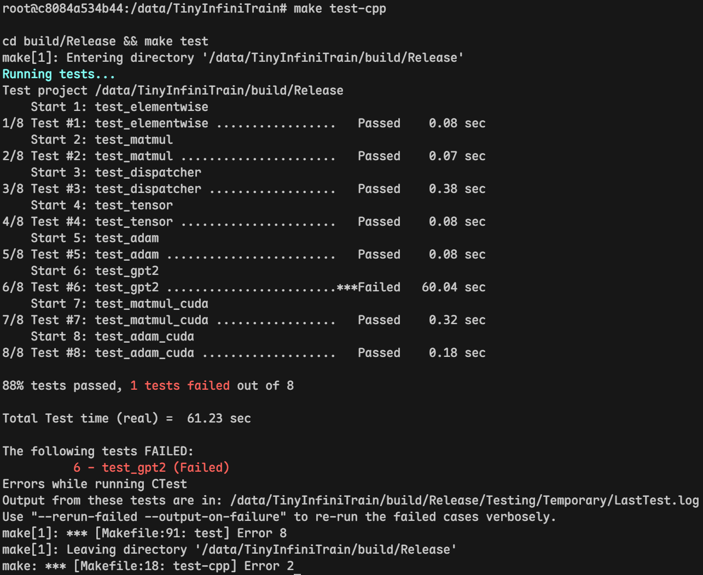

# TinyInfiniTrain 作业报告

## 一、test 通过截图



输出日志
```log

6/8 Testing: test_gpt2
6/8 Test: test_gpt2
Command: "/data/TinyInfiniTrain/build/Release/test_gpt2"
Directory: /data/TinyInfiniTrain/build/Release
"test_gpt2" start time: Aug 11 11:30 UTC
Output:
----------------------------------------------------------
Running main() from /data/TinyInfiniTrain/third_party/googletest/googletest/src/gtest_main.cc
[==========] Running 1 test from 1 test suite.
[----------] Global test environment set-up.
[----------] 1 test from GPT2TrainingTest
[ RUN      ] GPT2TrainingTest.LogitsConsistency
WARNING: Logging before InitGoogleLogging() is written to STDERR
E20260811 11:31:16.675404 140585347969024 net.cc:320] magic: 20240326 version: 3 block_size: 1024 vocab_size: 50257 n_layer: 12 n_head: 12 n_embd: 768 padded_vocab_size: 50304
I20260811 11:31:17.383246 140585347969024 test_gpt2.cc:127] Initialize() finished!
I20260811 11:31:17.383310 140585347969024 test_gpt2.cc:219] epoch: 0
I20260811 11:31:17.620037 140585347969024 test_gpt2.cc:219] epoch: 1
I20260811 11:31:17.821481 140585347969024 test_gpt2.cc:219] epoch: 2
I20260811 11:31:18.017616 140585347969024 test_gpt2.cc:219] epoch: 3
I20260811 11:31:18.214868 140585347969024 test_gpt2.cc:219] epoch: 4
I20260811 11:31:18.411920 140585347969024 test_gpt2.cc:219] epoch: 5
I20260811 11:31:18.607441 140585347969024 test_gpt2.cc:219] epoch: 6
I20260811 11:31:18.804585 140585347969024 test_gpt2.cc:219] epoch: 7
I20260811 11:31:19.000771 140585347969024 test_gpt2.cc:219] epoch: 8
I20260811 11:31:19.196948 140585347969024 test_gpt2.cc:219] epoch: 9
I20260811 11:31:19.393650 140585347969024 tokenizer.cc:184] start generate text:
The meaning of life is that it is continuous and play that might last." Too little quickening. Art and tragedy and psychedelia, especially what I call herws, don't emit a kind of absolutism and admiration for those lives.<|endoftext|>At 23 has unaddressed a fateful faith debate on a federal
I20260811 11:31:21.830786 140585347969024 test_gpt2.cc:219] epoch: 10
I20260811 11:31:22.052607 140585347969024 test_gpt2.cc:93] Logits mismatch at position 385973: Reference=-204.265, Current=-204.26, Diff=0.00506592
/data/TinyInfiniTrain/test/example/test_gpt2.cc:237: Failure
Value of: validation_passed
  Actual: false
Expected: true
Logits validation failed!

[  FAILED  ] GPT2TrainingTest.LogitsConsistency (59843 ms)
[----------] 1 test from GPT2TrainingTest (59843 ms total)

[----------] Global test environment tear-down
[==========] 1 test from 1 test suite ran. (59843 ms total)
[  PASSED  ] 0 tests.
[  FAILED  ] 1 test, listed below:
[  FAILED  ] GPT2TrainingTest.LogitsConsistency

 1 FAILED TEST
<end of output>
Test time =  60.04 sec
----------------------------------------------------------
Test Failed.
"test_gpt2" end time: Aug 11 11:31 UTC
"test_gpt2" time elapsed: 00:01:00
----------------------------------------------------------

```

## 二、作业步骤

> 将代码填入下面代码块中指定位置，并详细描述完成该作业的解决思路和遇到的问题。

### 作业一：autograd机制调用Neg kernel的实现

难度：⭐

对应测例：`TEST(ElementwiseTest, NegForward)`，`TEST(ElementwiseTest, NegBackward)`

需要实现的代码块位置：`infini_train/src/autograd/elementwise.cc`

```c++
std::vector<std::shared_ptr<Tensor>> Neg::Forward(const std::vector<std::shared_ptr<Tensor>> &input_tensors) {
    // =================================== 作业 ===================================
    // TODO：通过Dispatcher获取设备专属kernel，对输入张量进行取反操作
    // HINT: 依赖test_dispatcher，kernel实现已给出
    // =================================== 作业 ===================================
    CHECK_EQ(input_tensors.size(), 1);
    const auto &input = input_tensors[0];
    auto device = input->GetDevice().Type();
    auto kernel = Dispatcher::Instance().GetKernel({device, "NegForward"});
    return {kernel.Call<std::shared_ptr<Tensor>>(input)};
}

std::vector<std::shared_ptr<Tensor>> Neg::Backward(const std::vector<std::shared_ptr<Tensor>> &grad_outputs) {
    // =================================== 作业 ===================================
    // TODO：通过Dispatcher获取设备专属的反向传播kernel，计算梯度
    // HINT: 依赖test_dispatcher，kernel实现已给出
    // =================================== 作业 ===================================
    CHECK_EQ(grad_outputs.size(), 1);
    const auto &grad_output = grad_outputs[0];
    auto device = grad_output->GetDevice().Type();
    auto kernel = Dispatcher::Instance().GetKernel({device, "NegBackward"});
    return {kernel.Call<std::shared_ptr<Tensor>>(grad_output)};
}
```

#### 解决思路
1. Neg::Forward(): 不需要实现算子，读出 input_tensors 里的数据，根据 tensor 的  属性调用对应设备的算子即可；
2. Neg::Backward(): 同理，读 grad_outputs 里的 data_ 和 device_，调用对应设备的算子即可


#### 遇到问题


### 作业二：实现矩阵乘法

难度：⭐⭐

#### CPU实现

对应测例：`TEST(MatmulTest, BasicMatrixMultiply)`，`TEST(MatmulTest, BatchedMatrixMultiply)`, `TEST(MatmulTest, BackwardPass)`

需要实现的代码块位置：`infini_train/src/kernels/cpu/linear.cc`

```c++
    std::shared_ptr<Tensor> MatmulForward(const std::shared_ptr<Tensor> &input, const std::shared_ptr<Tensor> &other) {
        // =================================== 作业 ===================================
        // TODO：实现CPU上的矩阵乘法前向计算
        // REF:
        // =================================== 作业 ===================================
        const auto &input_dims = input->Dims();
        const auto &other_dims = other->Dims();
        CHECK(input_dims.size() == 2 || input_dims.size() == 3);
        CHECK_EQ(input_dims.size(), other_dims.size());
        CHECK_EQ(input_dims[input_dims.size() - 1],
                other_dims[other_dims.size() - 2]);
        CHECK_EQ(static_cast<int>(input->Dtype()), static_cast<int>(other->Dtype()));

        const int64_t M = input_dims[input_dims.size() - 2];
        const int64_t K = input_dims[input_dims.size() - 1];
        const int64_t N = other_dims[other_dims.size() - 1];

        std::vector<int64_t> output_dims;
        int64_t batch_size = 1;
        if (input_dims.size() == 3) {
            CHECK_EQ(input_dims[0], other_dims[0]);
            batch_size = input_dims[0];
            output_dims = {batch_size, M, N};
        } else {
            output_dims = {M, N};
        }

        auto output = std::make_shared<Tensor>(output_dims, DataType::kFLOAT32,
                                                Device(DeviceType::kCPU, 0));
        output->Fill(0.0f);

        float *input_data = static_cast<float *>(input->DataPtr());
        float *other_data = static_cast<float *>(other->DataPtr());
        float *output_data = static_cast<float *>(output->DataPtr());

        for (int b = 0; b < batch_size; b++) {
            for (int i = 0; i < M; i++) {
            for (int h = 0; h < K; h++) {
                const float t = input_data[b * M * K + i * K + h];
                for (int j = 0; j < N; j++) {
                output_data[b * M * N + i * N + j] +=
                    t * other_data[b * K * N + h * N + j];
                }
            }
            }
        }

    return {output};
    }

    std::tuple<std::shared_ptr<Tensor>, std::shared_ptr<Tensor>>
        MatmulBackward(const std::shared_ptr<Tensor> &input, const std::shared_ptr<Tensor> &other,
                    const std::shared_ptr<Tensor> &grad_output) {
        // =================================== 作业 ===================================
        // TODO：实现CPU上的矩阵乘法反向传播
        // REF:
        // =================================== 作业 ===================================
        // * dA = dC * B^T, dB = A^T * dC，NOTE: 通过改写下标实现矩阵转置
        const auto &input_dims = input->Dims();
        const auto &other_dims = other->Dims();
        const auto &grad_output_dims = grad_output->Dims();
        CHECK(input_dims.size() == 2);
        CHECK_EQ(input_dims.size(), other_dims.size());
        CHECK_EQ(input_dims.size(), grad_output_dims.size());
        CHECK_EQ(input_dims[input_dims.size() - 1],
                other_dims[other_dims.size() - 2]);
        CHECK_EQ(grad_output_dims[grad_output_dims.size() - 1],
                other_dims[other_dims.size() - 1]);
        CHECK_EQ(grad_output_dims[grad_output_dims.size() - 2],
                input_dims[input_dims.size() - 2]);

        const int64_t M = input_dims[input_dims.size() - 2];
        const int64_t K = input_dims[input_dims.size() - 1];
        const int64_t N = other_dims[other_dims.size() - 1];
        std::vector<int64_t> grad_input_dims;
        std::vector<int64_t> grad_other_dims;
        int64_t batch_size = 1;
        if (input_dims.size() == 3) {
            CHECK_EQ(input_dims[0], other_dims[0]);
            CHECK_EQ(input_dims[0], grad_output_dims[0]);
            batch_size = input_dims[0];
            grad_input_dims = {batch_size, M, K};
            grad_other_dims = {batch_size, K, N};
        } else {
            grad_input_dims = {M, K};
            grad_other_dims = {K, N};
        }
        auto grad_input =
            std::make_shared<Tensor>(grad_input_dims, DataType::kFLOAT32);
        auto grad_other =
            std::make_shared<Tensor>(grad_other_dims, DataType::kFLOAT32);
        grad_input->Fill(0.0f);
        grad_other->Fill(0.0f);

        float *input_data = static_cast<float *>(input->DataPtr());
        float *other_data = static_cast<float *>(other->DataPtr());
        float *grad_output_data = static_cast<float *>(grad_output->DataPtr());
        float *grad_input_data = static_cast<float *>(grad_input->DataPtr());
        float *grad_other_data = static_cast<float *>(grad_other->DataPtr());
        // A: [B, M, K]; B: [B, K, N], dC: [B, M, N]
        for (int b = 0; b < batch_size; b++) {
            const int input_offset = b * M * K;
            const int other_offset = b * K * N;
            const int grad_output_offset = b * M * N;
            // dA = dC * B^T, dA: [B, M, K] 嵌套关系：i→h→j
            for (int i = 0; i < M; i++) {
            for (int h = 0; h < K; h++) {
                for (int j = 0; j < N; j++) {
                // dA_{i, h} = \sum{ dC_{i, j} * B^T_{j, h} } = \sum{ dC_{i, j} *
                // B_{h, j} }
                grad_input_data[input_offset + i * K + h] +=
                    grad_output_data[grad_output_offset + i * N + j] *
                    other_data[other_offset + h * N + j];
                }
            }
            }
            // dB = A^T * dC, dB: [B, K, N] 嵌套关系: h→j→i
            for (int h = 0; h < K; h++) {
            for (int j = 0; j < N; j++) {
                for (int i = 0; i < M; i++) {
                // dB_{h, j} = \sum{ A^T_{h, i} * dC_{i, j} } = \sum{ A_{i, h} *
                // dC_{i, j} }
                grad_other_data[other_offset + h * N + j] +=
                    input_data[input_offset + i * K + h] *
                    grad_output_data[grad_output_offset + i * N + j];
                }
            }
            }
        }
        return {grad_input, grad_other};
    }
```

#### CUDA实现

对应测例：`TEST(MatmulTest, BasicMatrixMultiplyCuda)`,`TEST(MatmulTest, BatchedMatrixMultiplyCuda)`,`TEST(MatmulTest, BackwardPassCuda)`

需要实现的代码块位置：`infini_train/src/kernels/cuda/linear.cu`

```c++
    std::shared_ptr<Tensor> MatmulForward(const std::shared_ptr<Tensor> &input, const std::shared_ptr<Tensor> &other) {
        // =================================== 作业 ===================================
        // TODO：实现CUDA上的矩阵乘法前向计算
        // REF:
        // =================================== 作业 ===================================
        const auto& input_dims = input->Dims();
        const auto& other_dims = other->Dims();
        const size_t ndim = input_dims.size();
        CHECK_GE(input_dims.size(), 2);
        CHECK_EQ(input_dims.size(), other_dims.size());
        for (size_t i = 0; i + 2 < ndim; ++i) {
            CHECK_EQ(input_dims[i], other_dims[i]);
        }
        CHECK_EQ(input_dims[ndim - 1], other_dims[ndim - 2]);

        const int64_t M = input_dims[ndim - 2];
        const int64_t K = input_dims[ndim - 1];
        const int64_t N = other_dims[ndim - 1];
        auto output_dims = input_dims;
        output_dims[ndim - 2] = M;
        output_dims[ndim - 1] = N;
        const int64_t batch_size =
            std::accumulate(input_dims.begin(), input_dims.end() - 2, int64_t{1},
                            std::multiplies<int64_t>{});

        CHECK_EQ(static_cast<int>(input->Dtype()),
                static_cast<int>(other->Dtype()));
        const auto dtype = input->Dtype();
        auto output =
            std::make_shared<Tensor>(output_dims, dtype, input->GetDevice());

        // input: [M, K] → [K, M]
        // other: [K, N] → [N, K]
        // output = input * other → output^T = other^T * input^T
        const float alpha = 1.0f;
        const float beta = 0.0f;
        const long long input_stride = M * K;
        const long long other_stride = K * N;
        const long long output_stride = M * N;
        // handle 是 cuBLAS 的运行上下文，保存运行状态和管理资源
        cublasHandle_t handle;
        CUBLAS_CHECK(cublasCreate(&handle));
        // C = alpha * op(A) * op(B) + beta * C
        switch (dtype) {
            case DataType::kFLOAT32:
            CUBLAS_CHECK(cublasGemmStridedBatchedEx(
                handle, CUBLAS_OP_N, CUBLAS_OP_N, N, M, K, &alpha,
                other->DataPtr(), CUDA_R_32F, N, other_stride, input->DataPtr(),
                CUDA_R_32F, K, input_stride, &beta, output->DataPtr(), CUDA_R_32F, N,
                output_stride, batch_size, CUDA_R_32F, CUBLAS_GEMM_DEFAULT));
            break;
            case DataType::kBFLOAT16:
            CUBLAS_CHECK(cublasGemmStridedBatchedEx(
                handle, CUBLAS_OP_N, CUBLAS_OP_N, N, M, K, &alpha,
                other->DataPtr(), CUDA_R_16BF, N, other_stride, input->DataPtr(),
                CUDA_R_16BF, K, input_stride, &beta, output->DataPtr(), CUDA_R_16BF,
                N, output_stride, batch_size, CUDA_R_32F, CUBLAS_GEMM_DEFAULT));
            break;
            default:
            LOG(FATAL) << "Unsupported data type in MatmulForward CUDA kernel";
        }
        CUBLAS_CHECK(cublasDestroy(handle));
        return output;
    }

    std::tuple<std::shared_ptr<Tensor>, std::shared_ptr<Tensor>>
        MatmulBackward(const std::shared_ptr<Tensor> &input, const std::shared_ptr<Tensor> &other,
                    const std::shared_ptr<Tensor> &grad_output) {
        // =================================== 作业 ===================================
        // TODO：实现CUDA上的矩阵乘法反向传播
        // REF:
        // =================================== 作业 ===================================
        const auto& input_dims = input->Dims();
        const auto& other_dims = other->Dims();
        const auto& grad_output_dims = grad_output->Dims();
        const size_t ndim = input_dims.size();
        CHECK_GE(input_dims.size(), 2);
        CHECK_EQ(input_dims.size(), other_dims.size());
        CHECK_EQ(input_dims.size(), grad_output_dims.size());
        for (size_t i = 0; i + 2 < ndim; ++i) {
            CHECK_EQ(input_dims[i], other_dims[i]);
            CHECK_EQ(input_dims[i], grad_output_dims[i]);
        }
        CHECK_EQ(input_dims[ndim - 1], other_dims[ndim - 2]);
        CHECK_EQ(grad_output_dims[ndim - 2], input_dims[ndim - 2]);
        CHECK_EQ(grad_output_dims[ndim - 1], other_dims[ndim - 1]);

        const int64_t M = input_dims[ndim - 2];
        const int64_t K = input_dims[ndim - 1];
        const int64_t N = other_dims[ndim - 1];
        const int64_t batch_size =
            std::accumulate(input_dims.begin(), input_dims.end() - 2, int64_t{1},
                            std::multiplies<int64_t>{});
        auto grad_input_dims = input_dims;
        auto grad_other_dims = other_dims;
        CHECK_EQ(static_cast<int>(input->Dtype()),
                static_cast<int>(other->Dtype()));
        CHECK_EQ(static_cast<int>(input->Dtype()),
                static_cast<int>(grad_output->Dtype()));
        const auto dtype = input->Dtype();
        auto grad_input = std::make_shared<Tensor>(grad_input_dims, dtype,
                                                    input->GetDevice());
        auto grad_other = std::make_shared<Tensor>(grad_other_dims, dtype,
                                                    other->GetDevice());

        const long long input_stride = M * K;
        const long long other_stride = K * N;
        const long long grad_output_stride = M * N;
        const long long grad_input_stride = M * K;
        const long long grad_other_stride = K * N;
        const float alpha = 1.0f;
        const float beta = 0.0f;
        cublasHandle_t handle;
        CUBLAS_CHECK(cublasCreate(&handle));
        // dA = dC * B^T, dA^T = B * dC^T
        switch (dtype) {
            case DataType::kFLOAT32:
            CUBLAS_CHECK(cublasGemmStridedBatchedEx(
                handle, CUBLAS_OP_T, CUBLAS_OP_N, K, M, N, &alpha,
                other->DataPtr(), CUDA_R_32F, N, other_stride,
                grad_output->DataPtr(), CUDA_R_32F, N, grad_output_stride, &beta,
                grad_input->DataPtr(), CUDA_R_32F, K, grad_input_stride, batch_size,
                CUDA_R_32F, CUBLAS_GEMM_DEFAULT));
            break;
            case DataType::kBFLOAT16:
            CUBLAS_CHECK(cublasGemmStridedBatchedEx(
                handle, CUBLAS_OP_T, CUBLAS_OP_N, K, M, N, &alpha,
                other->DataPtr(), CUDA_R_16BF, N, other_stride,
                grad_output->DataPtr(), CUDA_R_16BF, N, grad_output_stride, &beta,
                grad_input->DataPtr(), CUDA_R_16BF, K, grad_input_stride, batch_size,
                CUDA_R_32F, CUBLAS_GEMM_DEFAULT));
            break;
            default:
            LOG(FATAL) << "Unsupported data type in MatmulBackward CUDA kernel";
        }

        // dB = A^T * dC, dB^T = dC^T * A
        switch (dtype) {
            case DataType::kFLOAT32:
            CUBLAS_CHECK(cublasGemmStridedBatchedEx(
                handle, CUBLAS_OP_N, CUBLAS_OP_T, N, K, M, &alpha,
                grad_output->DataPtr(), CUDA_R_32F, N, grad_output_stride,
                input->DataPtr(), CUDA_R_32F, K, input_stride, &beta,
                grad_other->DataPtr(), CUDA_R_32F, N, grad_other_stride, batch_size,
                CUDA_R_32F, CUBLAS_GEMM_DEFAULT));
            break;
            case DataType::kBFLOAT16:
            CUBLAS_CHECK(cublasGemmStridedBatchedEx(
                handle, CUBLAS_OP_N, CUBLAS_OP_T, N, K, M, &alpha,
                grad_output->DataPtr(), CUDA_R_16BF, N, grad_output_stride,
                input->DataPtr(), CUDA_R_16BF, K, input_stride, &beta,
                grad_other->DataPtr(), CUDA_R_16BF, N, grad_other_stride, batch_size,
                CUDA_R_32F, CUBLAS_GEMM_DEFAULT));
            break;
            default:
            LOG(FATAL) << "Unsupported data type in MatmulBackward CUDA kernel";
        }

        CUBLAS_CHECK(cublasDestroy(handle));
        return {grad_input, grad_other};
    }
```

#### 解决思路
##### CPU 实现
1. 矩阵乘法：当前实现为朴素实现的“i-k-j"版本，即优化了内存访问。具体能支持 bs > 1 的二维矩阵乘法
2. 矩阵反向传播：同理，根据计算公式，采用和矩阵乘法类似的思路，不同的是仅支持二维矩阵的反向传播计算，另外是通过改变坐标达到转置的效果
##### CUDA 实现

主要是通过数据处理调用cuBLAS完成的计算，需要注意的是当前框架内使用的 tensor 为 row-major，但 cuBLAS 是 col-major

#### 遇到问题
1. 矩阵坐标计算和转置实现
2. 矩阵求导计算
3. cuBLAS库API
1和2通过数学公式推导出来了，3查资料解决的

### 作业三：实现Adam优化器

难度：⭐

#### CPU实现

对应测例：`TEST(AdamOptimizerTest, BasicParameterUpdate)`,`TEST(AdamOptimizerTest, MomentumAccumulation)`

代码位置：infini_train/src/kernels/cpu/accumulate_grad.cc

```c++
void AdamAccumulateGrad(const std::shared_ptr<Tensor> &grad, const std::shared_ptr<Tensor> &param,
                        const std::shared_ptr<Tensor> &m, const std::shared_ptr<Tensor> &v, float learning_rate,
                        float beta1, float beta2, float eps, int64_t t) {
    // =================================== 作业 ===================================
    // TODO：实现Adam优化器的梯度累积和参数更新
    // REF: 
    // =================================== 作业 ===================================
    auto *grad_data = static_cast<const float *>(grad->DataPtr());
    auto *param_data = static_cast<float *>(param->DataPtr());
    auto *m_data = static_cast<float *>(m->DataPtr());
    auto *v_data = static_cast<float *>(v->DataPtr());
    int64_t n = param->NumElements();
    for (int64_t i = 0; i < n; ++i) {
        m_data[i] = beta1 * m_data[i] + (1 - beta1) * grad_data[i];
        v_data[i] = beta2 * v_data[i] + (1 - beta2) * grad_data[i] * grad_data[i];
        auto m_hat = m_data[i] / (1 - pow(beta1, t));
        auto v_hat = v_data[i] / (1 - pow(beta2, t));
        param_data[i] = param_data[i] - learning_rate * m_hat / (sqrt(v_hat) + eps);
    }
}
```

#### CUDA实现

对应测例：`TEST(AdamOptimizerTest, BasicParameterUpdateCuda)`,`TEST(AdamOptimizerTest, MomentumAccumulationCuda)`

代码位置：infini_train/src/kernels/cuda/accumulate_grad.cu

```c++
__global__ void AdamAccumulateGradKernel(const float* grad_data_ptr,
                                         float* param_data_ptr,
                                         float* m_data_ptr, float* v_data_ptr,
                                         float learning_rate, float beta1,
                                         float beta2, float eps, int64_t t,
                                         const size_t n) {
  int idx = blockIdx.x * blockDim.x + threadIdx.x;
  int stride = blockDim.x * gridDim.x;
  for (int i = idx; i < n; i += stride) {
    m_data_ptr[i] = beta1 * m_data_ptr[i] + (1 - beta1) * grad_data_ptr[i];
    v_data_ptr[i] = beta2 * v_data_ptr[i] +
                    (1 - beta2) * grad_data_ptr[i] * grad_data_ptr[i];
    float m_hat = m_data_ptr[i] / (1 - pow(beta1, t));
    float v_hat = v_data_ptr[i] / (1 - pow(beta2, t));
    param_data_ptr[i] =
        param_data_ptr[i] - learning_rate * m_hat / (sqrt(v_hat) + eps);
  }
}

void AdamAccumulateGrad(const std::shared_ptr<Tensor> &grad, const std::shared_ptr<Tensor> &param,
                        const std::shared_ptr<Tensor> &m, const std::shared_ptr<Tensor> &v, float learning_rate,
                        float beta1, float beta2, float eps, int64_t t) {
    // =================================== 作业 ===================================
    // TODO：实现Adam优化器的梯度累积和参数更新
    // REF: 
    // =================================== 作业 ===================================
    const float* grad_data_ptr = static_cast<const float*>(grad->DataPtr());
    float* param_data_ptr = static_cast<float*>(param->DataPtr());
    float* m_data_ptr = static_cast<float*>(m->DataPtr());
    float* v_data_ptr = static_cast<float*>(v->DataPtr());

    size_t num_elements = param->NumElements();
    int thread_per_block = 256;
    int num_blocks = (num_elements + thread_per_block - 1) / thread_per_block;
    AdamAccumulateGradKernel<<<num_blocks, thread_per_block>>>(
        grad_data_ptr, param_data_ptr, m_data_ptr, v_data_ptr, learning_rate,
        beta1, beta2, eps, t, num_elements);
}
```

#### 解决思路
##### CPU 实现
根据 Adam 数学原理完成代码编写即可
##### CUDA 实现
实现分为两部分：算子准备函数和算子，其中算子准备函数由CPU执行，主要负责确定具体计算的数据以及控制算子的线程模型。
#### 遇到问题

1. 数据存储

    - 问题描述：最初在完成 infini_train/src/kernels/cuda/accumulate_grad.cu 里的 TODO 时，第一反应是想通过`AdamAccumulateGrad → AccumulateGrad → AccumulateGradKernel` 这样的控制流完成 Adam 的 cuda 算子，但是实际会出现无法解引用数据地址的问题。
    - 解决方案：本身上面的控制流不成立，单独编写一个 cuda 函数（即 AdamAccumulateGradKernel）接收经过预处理后的数据进行计算。

### 作业四：实现Tensor基础操作

#### 实现Tensor的Flatten操作

难度：⭐

对应测例：`TEST(TensorTransformTest, Flatten2DTo1D)`,`TEST(TensorTransformTest, FlattenWithRange) `,`TEST(TensorTransformTest, FlattenNonContiguous)`

代码位置：infini_train/src/tensor.cc

```c++
std::shared_ptr<Tensor> Tensor::Flatten(int64_t start, int64_t end) {
    // =================================== 作业 ===================================
    // TODO：实现张量扁平化操作，将指定维度范围[start, end]内的所有维度合并为一个维度
    // HINT: 
    // =================================== 作业 ===================================
    auto ndim = dims_.size();
    //  * NOTE: dims_[start, end]合并
    auto start_idx = start >= 0 ? start : start + ndim;
    auto end_idx = end >= 0 ? end : end + ndim;
    CHECK(start_idx >= 0 && end_idx < ndim && start_idx <= end_idx);
    std::vector<int64_t> new_shape;
    int64_t mul = 1;
    for (int i = 0; i < ndim; ++i) {
        if (start_idx <= i && i <= end_idx) {
        mul *= dims_[i];
        if (i == end_idx) {
            new_shape.push_back(mul);
        }
        } else {
        new_shape.push_back(dims_[i]);
        }
    }
    return Contiguous()->View(new_shape);
}
```

#### 实现Tensor的反向传播机制

难度：⭐

对应测例：`TEST(TensorAutogradTest, BackwardComputesGradient)`,`TEST(TensorAutogradTest, BackwardWithMultipleOutputs)`

代码位置：infini_train/src/tensor.cc

```c++
void Tensor::Backward(std::shared_ptr<Tensor> gradient, bool retain_graph, bool create_graph) const {
    // =================================== 作业 ===================================
    // TODO：实现自动微分反向传播
    // 功能描述：1. 计算当前张量对叶子节点的梯度    2. 支持多输出场景的梯度累加
    // HINT: 
    // =================================== 作业 ===================================
    CHECK(requires_grad_);
    // 检查是否存在反向传播入口
    if (!grad_fn_) {
        return;
    }
    // 表示反向传播从当前开始
    if (gradient == nullptr) {
        // 检查是否为标量
        CHECK_EQ(dims_.size(), 0);
        gradient =
            std::make_shared<Tensor>(std::vector<int64_t>{}, dtype_, GetDevice());
        gradient->Fill(1.0f);
    } else {
        CHECK_EQ(static_cast<int>(GetDevice().Type()),
                static_cast<int>(gradient->GetDevice().Type()));
        CHECK_EQ(dims_.size(), gradient->dims_.size());
        for (int i = 0; i < dims_.size(); i++) {
        CHECK_EQ(dims_[i], gradient->Dims()[i]);
        }
    }
    grad_fn_->BackwardPartial(gradient, output_idx_);
}
```

#### 解决思路

1. Flatten: 核心是扁平化前后内存布局不发生变化，变的只是 view 视角。故原则上只需要修改 tensor 的 dims_ 即可。根据测试用例，额外处理索引为负和内存布局不连续的情况即可。
2. Backward: 函数本身在计算图的反向传播当中的定位是用户调用的入口，本身不进行反向传播计算，真正计算调用 BackwardPartial() 进行。不过在调用之前，需要进行判断节点是否：本身要求梯度；节点本身是否存储了 grad_fn_（即当前节点执行的 Function）。另外还需要单独处理当前输出为标量的情况（即反向传播启动），设置梯度为1即可。

#### 遇到问题

1. 计算图的前向和后向传播计算
    - 问题描述：实现 Backward() 函数时，首先需要清楚该函数本身在整个计算图反向传播中是什么定位，具体实现什么功能？
    - 解决方案：通过测试用例定位到计算图的构建是通过 Apply() 函数完成的，并且在同文件内找到了 BackwardPartial()。通过通过详细分析这两个函数清楚了计算图构建和反向传播的过程。

### 作业五 注册算子kernel的实现

难度：⭐⭐⭐

对应测例：`TEST(DispatcherTest, RegisterAndGetKernel)`,`TEST(DispatcherTest, DuplicateRegistration)`,`TEST(DispatcherTest, GetNonexistentKernel)`

代码位置：infini_train/include/dispatcher.h

```c++
template <typename RetT, class... ArgsT> RetT Call(ArgsT... args) const {
    // =================================== 作业 ===================================
    // TODO：实现通用kernel调用接口
    // 功能描述：将存储的函数指针转换为指定类型并调用
    // HINT: 
    // =================================== 作业 ===================================
    using FuncT = RetT (*)(ArgsT...);
    auto func = reinterpret_cast<FuncT>(func_ptr_);
    return func(args...);
}

template <typename FuncT> void Register(const KeyT &key, FuncT &&kernel) {
    // =================================== 作业 ===================================
    // TODO：实现kernel注册机制
    // 功能描述：将kernel函数与设备类型、名称绑定
    // =================================== 作业 ===================================
    CHECK(!key_to_kernel_map_.contains((key)))
        << "Kernel already registered: " << key.second << " on device " << static_cast<int>(key.first);
    key_to_kernel_map_.emplace(key, KernelFunction(std::forward<FuncT>(kernel)));
}

#define REGISTER_KERNEL(device, kernel_name, kernel_func)                                                              \
    static const bool kernel_name##_##registered = []() {                                                              \
        infini_train::Dispatcher::Instance().Register({device, #kernel_name}, kernel_func);                            \
        return true;                                                                                                   \
    }();                                                                                                               \
// =================================== 作业 ===================================
// TODO：实现自动注册宏
// 功能描述：在全局静态区注册kernel，避免显式初始化代码
// =================================== 作业 ===================================
```

#### 解决思路
###### Call()
1. 接收传递的函数返回类型和参数列表
2. 根据函数返回类型将先前存储的 void* 函数指针恢复
3. 调用算子并传递参数列表

###### Register()
1. 根据`./infini_train/src/kernel/`内的实现，算子注册通过`REGISTER_KERNEL`宏实现。所以控制流应当是 `REGISTER_KERNEL → Register()`

#### 遇到问题
完成该作业主要遇到的是CPP语法问题：
1. 通用函数转换以及参数列表传递
2. 宏（主要是遇到了`infini_train::Dispatcher::Instance().Register({device, #kernel_name}, kernel_func); `不能在全局作用域展开的问题）

通过查阅相关资料解决了上述问题


### 作业六：实现GPT-2整体训练

难度：⭐⭐⭐⭐

对应测例：`TEST_F(GPT2TrainingTest, LogitsConsistency)`

#### 训练过程logits对比

完成以上所有作业，补齐训练框架的所有实现，理论上`TEST_F(GPT2TrainingTest, LogitsConsistency)`可以通过，在用例中判断比较预置的值和单步正向传播计算结果是否在误差允许范围内相等。

#### 数据读取实现

代码位置：example/common/tiny_shakespeare_dataset.cc

```c++
TinyShakespeareFile ReadTinyShakespeareFile(const std::string &path, size_t sequence_length) {
    /* =================================== 作业 ===================================
       TODO：实现二进制数据集文件解析
       文件格式说明：
    ----------------------------------------------------------------------------------
    | HEADER (1024 bytes)                     | DATA (tokens)                        |
    | magic(4B) | version(4B) | num_toks(4B) | reserved(1012B) | token数据           |
    ----------------------------------------------------------------------------------
       =================================== 作业 =================================== */
    std::ifstream ifs(path, std::ios::binary);
    CHECK(ifs.is_open()) << "Failed to open dataset file: " << path;
    CHECK_GT(sequence_length, 0);
    constexpr size_t header_size = 1024;
    auto header = ReadSeveralBytesFromIfstream(header_size, &ifs);
    CHECK(ifs.good()) << "Failed to read dataset header: " << path;
    const int32_t magic = BytesToType<int32_t>(header, 0);
    const int32_t num_toks = BytesToType<int32_t>(header, 8);

    const auto type_it = kTypeMap.find(magic);
    CHECK(type_it != kTypeMap.end()) << "Unsupported dataset magic: " << magic;
    CHECK_GT(num_toks, 0) << "Dataset contains no tokens";
    const TinyShakespeareType type = type_it->second;

    // ! WARNING: 舍弃末尾 token
    const size_t num_seqs = static_cast<size_t>(num_toks) / sequence_length;
    std::vector<int64_t> dims = {static_cast<int64_t>(num_seqs),
                                static_cast<int64_t>(sequence_length)};
    TinyShakespeareFile result;
    result.type = type;
    result.dims = std::move(dims);
    result.tensor = infini_train::Tensor(result.dims, DataType::kINT64);
    const size_t num_elements = num_seqs * sequence_length;
    std::variant<std::vector<uint16_t>, std::vector<uint32_t>> buffer;
    switch (type) {
    case TinyShakespeareType::kUINT16:
        buffer = std::vector<uint16_t>(num_elements);
        break;
    case TinyShakespeareType::kUINT32:
        buffer = std::vector<uint32_t>(num_elements);
        break;
    default:
        LOG(FATAL) << "Unsupported dataset token type";
    }

    int64_t *dst = static_cast<int64_t *>(result.tensor.DataPtr());
    std::visit(
        // lamba 表达式： [捕获列表](参数列表) -> 返回类型 { 函数体 }
        [&](auto &tokens) {
            const size_t data_size_in_bytes = tokens.size() * sizeof(tokens[0]);
            ifs.read(reinterpret_cast<char *>(tokens.data()), data_size_in_bytes);
            CHECK_EQ(static_cast<size_t>(ifs.gcount()), data_size_in_bytes)
                << "dataset token data is truncated: " << path;

            for (size_t i = 0; i < tokens.size(); ++i) {
            dst[i] = static_cast<int64_t>(tokens[i]);
            }
        },
        buffer);
    return result;
}

TinyShakespeareDataset::TinyShakespeareDataset(const std::string &filepath, size_t sequence_length)
    : text_file_(ReadTinyShakespeareFile(filepath, sequence_length)),
      sequence_length_(sequence_length),
      sequence_size_in_bytes_(sequence_length * sizeof(int64_t)),
      num_samples_(static_cast<size_t>(text_file_.dims[0]) - 1)  {
    // =================================== 作业 ===================================
    // TODO：初始化数据集实例
    // HINT: 调用ReadTinyShakespeareFile加载数据文件
    // =================================== 作业 ===================================
}
```

#### Tokenizer功能实现

代码位置：example/common/tokenizer.cc

```c++
Tokenizer::Tokenizer(const std::string &filepath) {
    /* ===================================== 作业 =====================================
    TODO：实现Tokenizer二进制文件加载

    文件格式说明：
    ----------------------------------------------------------------------------------
    | HEADER (1024 bytes)                     | VOCAB TABLE                           |
    | magic(4B) | version(4B) | vocab_size(4B) | reserved(1012B) | token词表数据       |
    ----------------------------------------------------------------------------------
    ===================================== 作业 ===================================== */
    std::ifstream ifs(filepath, std::ios::binary);
    CHECK(ifs.is_open()) << "Failed to open tokenizer file: " << filepath;
    constexpr size_t header_size = 1024;
    auto header = ReadSeveralBytesFromIfstream(header_size, &ifs);
    CHECK(ifs.good()) << "Failed to read tokenizer header: " << filepath;

    magic_number_ = BytesToType<uint32_t>(header, 0);
    const auto version = BytesToType<uint32_t>(header, 4);
    vocab_size_ = BytesToType<uint32_t>(header, 8);

    CHECK(version == static_cast<uint32_t>(Version::kV1) ||
            version == static_cast<uint32_t>(Version::kV2))
        << "Unsupported tokenizer version: " << version;
    CHECK_GT(vocab_size_, 0) << "Tokenizer vocabulary must not be empty";

    const auto eot_it = kEotMap.find(magic_number_);
    CHECK(eot_it != kEotMap.end())
        << "Unsupported tokenizer magic: " << magic_number_;
    eot_token_ = eot_it->second;

    token_table_.reserve(vocab_size_);

    // * NOTE：词表区采用“长度 + token 原始字节”的变长格式
    // token i: | length(1 byte) | token 内容(length bytes) |
    for (uint32_t token_id = 0; token_id < vocab_size_; token_id++) {
        uint8_t token_len = 0;
        // std::ifstream::read() 的第一个参数类型固定为 char * 类型，也就是指针类型
        ifs.read(reinterpret_cast<char *>(&token_len), sizeof(token_len));
        CHECK_EQ(static_cast<size_t>(ifs.gcount()), sizeof(token_len))
            << "Failed to read token length: " << token_id;
        CHECK_GT(token_len, 0) << "Token length must be greater than zero";

        // '\0' 是填充
        std::string token(token_len, '\0');
        ifs.read(token.data(), token_len);
        CHECK_EQ(static_cast<size_t>(ifs.gcount()), static_cast<size_t>(token_len))
            << "Failed to read token: " << token_id;

        token_table_.push_back(std::move(token));
    }
}
```

```c++
std::string Tokenizer::Decode(uint32_t token_id) const {
    /* ===================================== 作业 =====================================
    TODO：实现token_id到文本的转换
    功能描述：根据token_id返回对应的文本片段
    ===================================== 作业 ===================================== */
    CHECK_LT(token_id, token_table_.size()) << "Invalid token id: " << token_id;
    return token_table_[token_id];
}
```

```c++
void Tokenizer::GenerateText(infini_train::nn::Module &model, uint32_t batch_size, uint32_t sequence_length,
                             uint32_t text_length, Device device) const {
    /* ...原代码... */
    LOG(INFO) << "start generate text:";
    for (int t = prompt_len; t < text_length; t++) {
        /* ===================================== 作业 =====================================
        TODO：实现单步文本生成逻辑
        HINT：调用model.Forward推理获取logits，根据推理结果进行随机采样，调用Decode获取文本结果
        ===================================== 作业 ===================================== */
        auto logits = model.Forward({x})[0];
        auto probabilities =
            nn::function::Softmax(logits, -1)->To(Device(DeviceType::kCPU, 0));
        float *probabilities_data_ptr =
            static_cast<float *>(probabilities.DataPtr());
        size_t offset = static_cast<size_t>(t - 1) * vocab_size_;
        float *next_token_probabilities = probabilities_data_ptr + offset;
        float coin = RandomF32(rng_state);
        int next_token_id = SampleMult(next_token_probabilities, vocab_size_, coin);
        x_buff[t] = next_token_id;
        std::cout << Decode(next_token_id);
        x = std::make_shared<Tensor>(x_tensor.To(device));
    }
    std::cout << std::endl;
}
```

#### 解决思路
1. Tokenizer: 首先读取1024B的文件头，提取其中的 magic 和 num_toks并对应获取eot符号。而后对之后的 token 数据进行处理：按照词表区“长度 + token 原始字节”的变长格式，先读取1个字节的长度 len，再提取 len 个字节的 token 即可
2. Decode: Tokenizer 最终能实现<token_id, token>的存储，仅需要根据传入的 token_id 返回对应的 token即可
3. GenerateText: 本身函数是通过调用底层API拼接完成流程，故按照模型推理流程组装即可（prefill得到logits，根据logits计算softmax，并对输入文本末尾的概率进行随机采样得到下一个位置的token id，对其 decode即可。往复prefill + decode阶段，直至遇到 eos 符号或者达到最大输出长度（当前项目为后者）


#### 遇到问题

1. cpp 文件处理 & 词表 token 数据的格式问题：查阅相关资料解决；
3. GenerateText本身的定位和具体的功能：查阅相关代码解决
4. 数据类型不一致的问题：底层算子要求INT64，但数据集解析时根据 magic 时确定的类型为 uint16_t，未作转换。解决方案：在解析词表数据集时，额外做一个数据类型转换即可
5. GEMM算子检查不通过：根因是前期完成作业时根据测试用例只考虑了二维和三维的情况，导致在 test_gpt2 测试中不能通过检查，补充高维情况即可 
6. 精度问题：暂未解决，误差是0.001，但实际测试的误差会在0.004上下